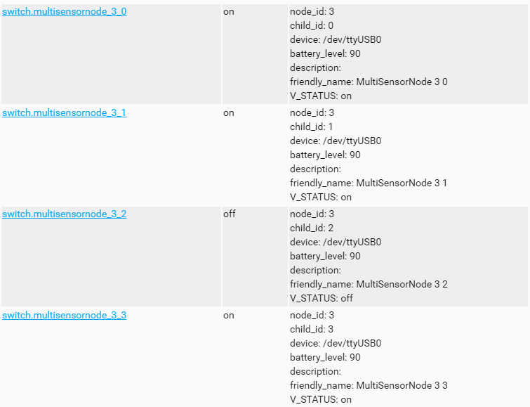

# TFT Switch
This is a sample sketch for a arduino mega with a 2.4" TFT Touchscreen.
It can show multiple Buttons on the screen and adds them as switches to the mysensors Controller.

# Dependencies
+ Adafruit GFX [Library](https://github.com/adafruit/Adafruit-GFX-Library)
+ TFT Library from [MCUFRIEND](https://github.com/prenticedavid/MCUFRIEND_kbv)
+ [Touchscreen](https://github.com/adafruit/Touch-Screen-Library) Library 
+ [MySensors](https://github.com/mysensors/MySensors)

# Parts
+ Arduino mega [Aliexpress](https://de.aliexpress.com/wholesale?SearchText=arduino+mega)
+ 2.4" TFT Shield [Aliexpress](https://de.aliexpress.com/wholesale?SearchText=2.4+tft+lcd) (if you change the TFT library it should work with other screens too)
+ NRF24L01+ Module [Aliexpress](https://de.aliexpress.com/wholesale?SearchText=nrf24l01)
    ### Optional
    + Power Pack (Battery)
    + Button or Sensor (for wakeup)

# Installation
### Software
+ Install the dependent libraries
+ Open this sketch in the Arduino IDE
+ Compile the sktech and load it on your arduino mega
### Wiring
+ TODO
### Images
In Homeassistant: 
